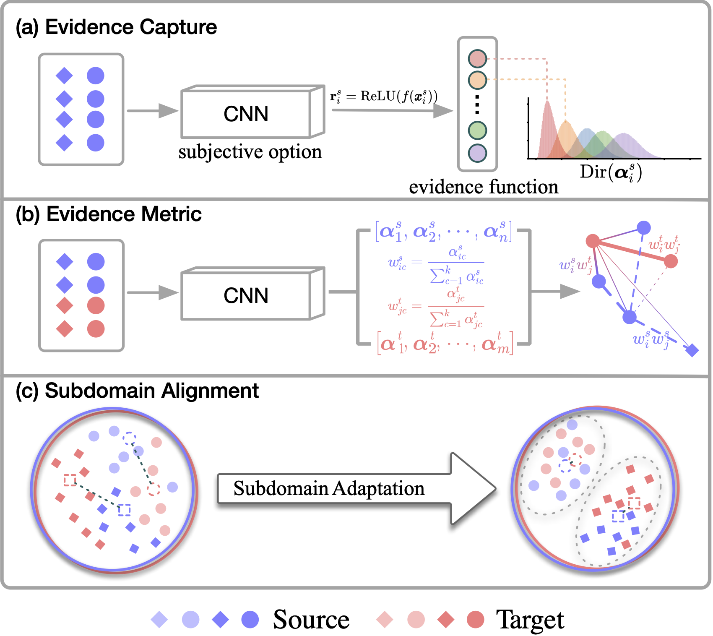
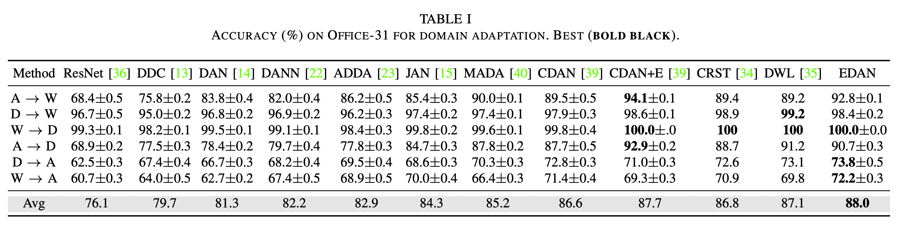
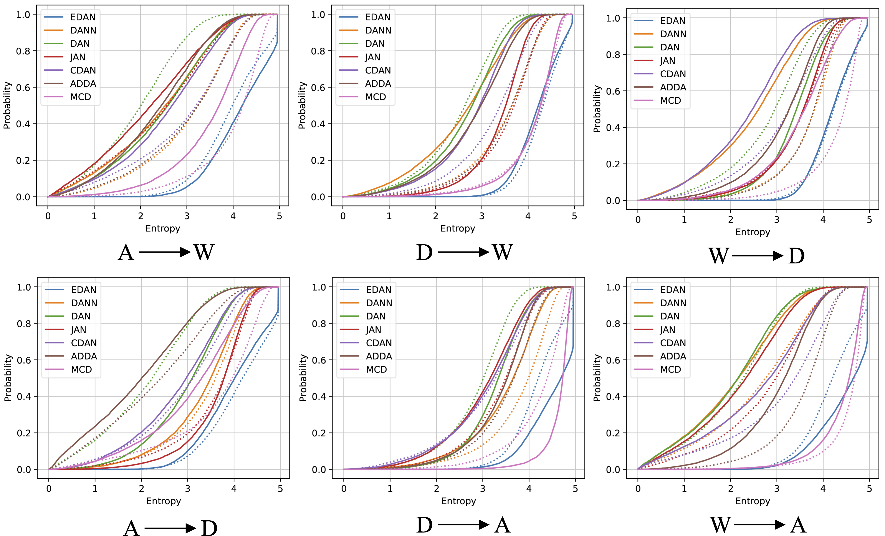
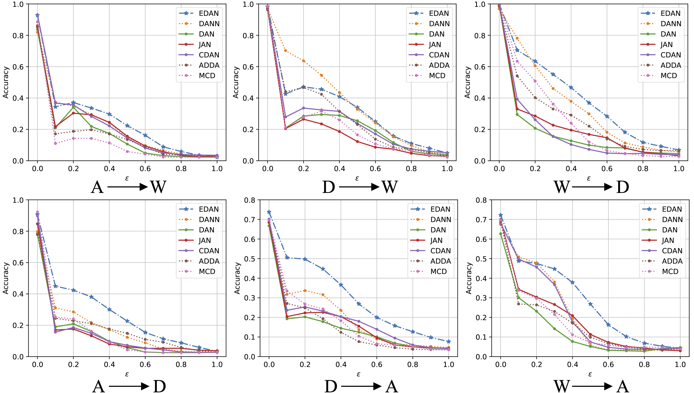

# Evidence Domain Adaptation Network

<div  align="center">    
    
</div>

We propose an Evidence Domain Adaptive Network (EDAN) that organically fuses evidence capture, evidence loss, and evidence metrics to achieve excellent robust transfer performance. 

## Dataset

First you should download the Office-31 dataset using:
```
!wget https://github.com/syorami/DDC-transfer-learning/raw/master/data/Office31.tar
!mkdir Office31
!tar xf Office31.tar -C Office31
```

## Usage

To run DATL model, use the following commands and arguments
```
python main.py [-src source] [-tar target]
```

| Argument | Description
| :--- | :----------
-src| dslr / webcam / amazon
-tar | dslr / webcam / amazon


## Example Results


On the Office-31 dataset, EDAN has an average accuracy of 88.0\%, which is better than other methods.

## Robustness Analysis
 <!-- With Out-of-distribution Sample -->
<div  align="center">    
     &nbsp &nbsp
    
</div>

<!--  -->

[**LEFT Figure**] shows the Empirical Cumulative Distribution Function (CDF) of each methods in the range of possible entropy $[0, \log31]$.
The curve near the bottom right corner of the figure is excellent, indicating the maximum entropy. 
EDAN achieves the best performance in uncertainty estimation.


<!-- ## Robustness Analysis With Adversarial Sample -->
<!--  -->
[**RIGHT Figure**]  shows the robustness evaluation of each method on different perturbation coefficients and different transfer tasks.
The closer the curve is to $y=1$, the better the performance.
The experimental results show that EDAN is more resilient to attacks than other competitors.
